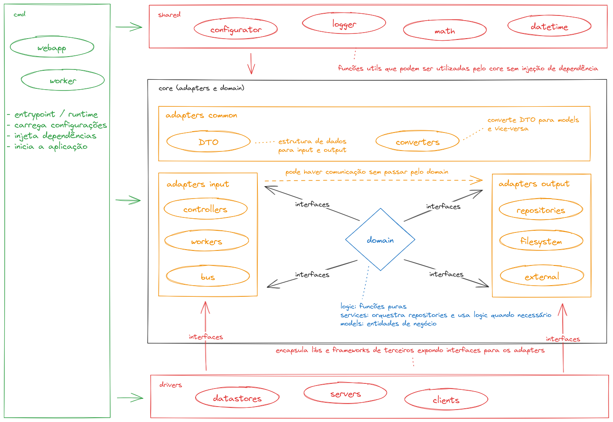

# Go Boilerplate

> Estrutura para projetos em Go



## Arquitetura

Arquitetura de software é uma estrutura que suporta os casos de uso do projeto
com o objetivo de facilitar a manutenção do código.
A arquitetura criada aqui foi inspirada em Arquitetura Hexagonal, Clean Architecture 
e Domain-Driven Design (DDD). As seguintes premissas foram adotadas:

- Independência de Frameworks
- Fácil de testar
- Estrutura de dados flexível
- Injeção de dependência
- Encapsulamento de bibliotecas externas
- Agilidade na mudança de banco de dados

As decisões para alcançar as premissas foram:

- Models representam estrutura de dados do domínio da aplicação e regras de negócio
- DTO são estruturas de dados que representam o input e output da aplicação
- Converters converte DTO para model e vice-versa
- Repositories armazenam e recuperam informações de sistemas externos (banco de dados, APIs remotas, filesystem...)
- Logic contém funções puras para regras de negócio
- Services podem orquestrar a utilização de múltiplos repositories e utilizar logic se necessário
- Ports contém as interfaces da camada domain
- Drivers encapsulam libs de terceiros e só devem ser utilizados pelos adapters
- Adapters orquestram o fluxo da aplicação desde a entrada de dados até a saída deles
- Shared são libs compartilhadas que não precisam ser injetadas e podem ser utilizadas por outras camadas
- Suporte a múltiplos databases
- Suporte a API Rest, gRPC, gRPC-Web e Websockets


## Estrutura

```python
.
├── cmd/                               # The entrypoint for each kind of application
├── src/
│   ├── shared/                        # Shared libs imported by adapters and domain layers without DI
│   ├── drivers/                       # Encapsulates third parties libs and exposes interfaces to be used by adapters
│   │   ├── datasources/
│   │   └── servers/
│   ├── adapters/                      # Manage the input and output
│   │   ├── dto/                       # Simple data structure to represent external data
│   │   ├── converters/                # Convert DTO to models and models to DTO
│   │   ├── controllers/               # Manage inputs from REST API
│   │   ├── repositories/              # Store and recover data from external storage like databases and queues
│   │   └── workers/                   # Manage communication with external services
│   └── domain/                        # Where the business logic and services lives
│       ├── ports/                     # Interfaces to be used outside this layer
│       ├── logic/
│       ├── services/
│       └── models/
├── resources/
│   └── data/                          # Schemas and initial data
├── .testignore                        # Ignore running tests
├── .covignore                         # Ignore coverage report
├── .envs/                             # Environment variables
├── Taskfile.yml                       # Used by Tasks
├── Dockerfile
├── docker-compose.yml
├── .editorconfig
└── .gitignore
```

## Como funciona?

### Tecnologias

#### Echo Framework

Echo é uma framework para desenvolvimento web que facilita a criação de APIs
Rest e renderização de templates HTML.  Suas principais características são:

- Router otimizado com zero alocação de memória dinâmica Organização de APIs em grupos
- Suporte a HTTP/2 Fácil de adicionar middlewares Data binding para o payload de request HTTP
- Renderização de templates
- Documentação simples e clara
- Código fonte bem organizado
- Comunidade ativa
- Diversas de aplicações em produção nos últimos anos

## Setup

```sh
docker compose up -d
make install   # Instala as dependências
make lint      # Roda o goimports para formatar o código Go
make mocks     # Cria mocks para os testes
make tests     # Executa os testes unitários
make start     # Roda a aplicação em localhost
```

Exemplo de como rodar tests por nome:

```sh
task unittest -- TestPisRepository
```

## Fluxo

1. O entrypoint em `cmd` carrega as configurações e  inicia o servidor HTTP ou worker.
2. O Controller HTTP ou Worker recebe um DTO de input e converte para Model.
3. Depois enviam o Model para o Service quando há lógica ou necessidade de acessar mais de um Repository. Mas podem enviar direto para o Repository, se for algo simples.  
   O Repository utiliza um Datasource, que encapsula a comunicação com o mundo externo (Postgres, Camunda ou Legacy Accessor).
4. O Controler ou Worker converte o Model para o DTO de output.
5. O Controller ou Worker atua como orquestrador de chamadas do Service ou Repository e por isso deve escrever os logs.
